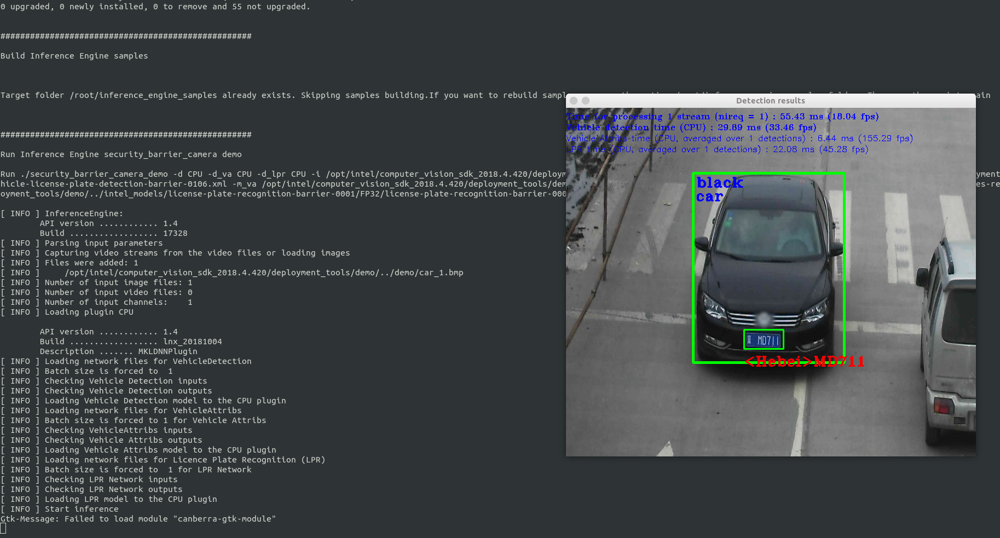
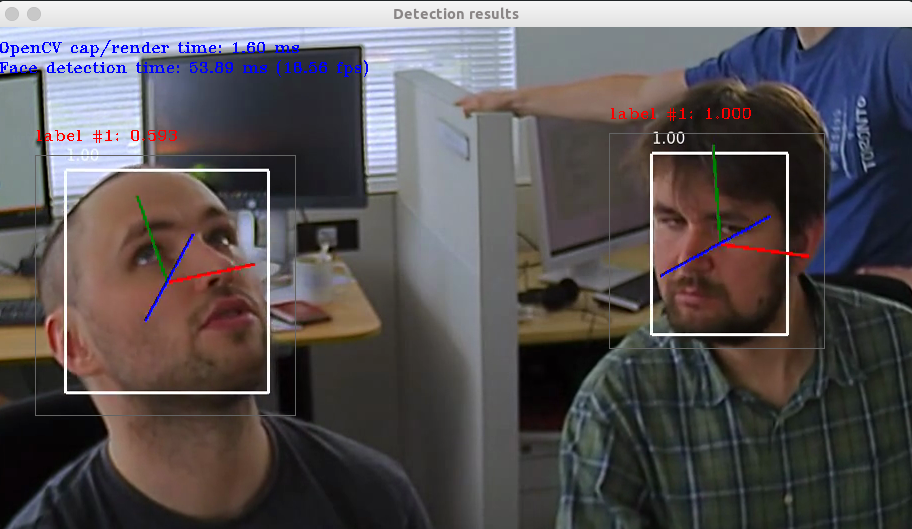

`docker` `openvino` `opencv`

## openvino的安装

1. 搜索docker镜像

   ```
   sudo docker search openvino
   ```

2. 拉取docker镜像

   ```
   docker pull openvinoincluit/openvino
   ```

3. 创建容器. `如果应用需要显示输出结果，例如输出视频和图像等，还需要通过宿主操作系统的x-server，因此在创建Docker容器的时候，我们额外指定了一些参数。Docker容器的网络方面我们直接借用宿主操作系统的网络。`

   ```
   docker create --name AI --net=host -it -e DISPLAY=$DISPLAY openvino
   ```

   > 参数说明 [ - - net](https://www.cnblogs.com/gispathfinder/p/5871043.html)  [DISPLAY](https://www.cnblogs.com/ruiyang-/p/10185840.html)

4. 启动docker容器

   ```
   docker start {容器id}
   ```

   可以通过`docker ps -a` 查看容器id

5. 宿主机需要启动xhost

   ```
   xhost +
   ```

6. 进入容器

   ```
   docker attach {容器id}
   ```

   `输入命令后需要回车`

7. 验证openvino的camera demo

   ```
   cd /opt/intel/computer_vision_sdk_2018.4.420/deployment_tools/demo
   ./demo_security_barrier_camera.sh 
   ```

   效果如下

   


## 验证其他模型

1. 编译intel预训练模型

   ```
   cd /opt/intel/computer_vision_sdk_2018.4.420/inference_engine/samples
   ./build_samples.sh 
   ```

   `在docker环境下`

2. 初始化openvino环境

   ```
   cd /opt/intel/computer_vision_sdk/bin
   source setupvars.sh
   ```

3. 验证人脸识别模型

   ```
   cd ~/inference_engine_samples_build/intel64/Release
   
   ./interactive_face_detection_demo -i face-detection-adas-0001.png -m /opt/intel/computer_vision_sdk_2018.4.420/deployment_tools/intel_models/face-detection-adas-0001/FP32/face-detection-adas-0001.xml -d CPU
   ```

   `face-detection-adas-0001.png`已经从`/opt/intel/computer_vision_sdk_2018.4.420/deployment_tools/intel_models/face-detection-adas-0001/description`拷贝到了`~/inference_engine_samples_build/intel64/Release下

4. 效果

   


## 其他

> [修改docker密码以及ssh登录](http://www.fecshop.com/topic/592)

   

   

   

   
